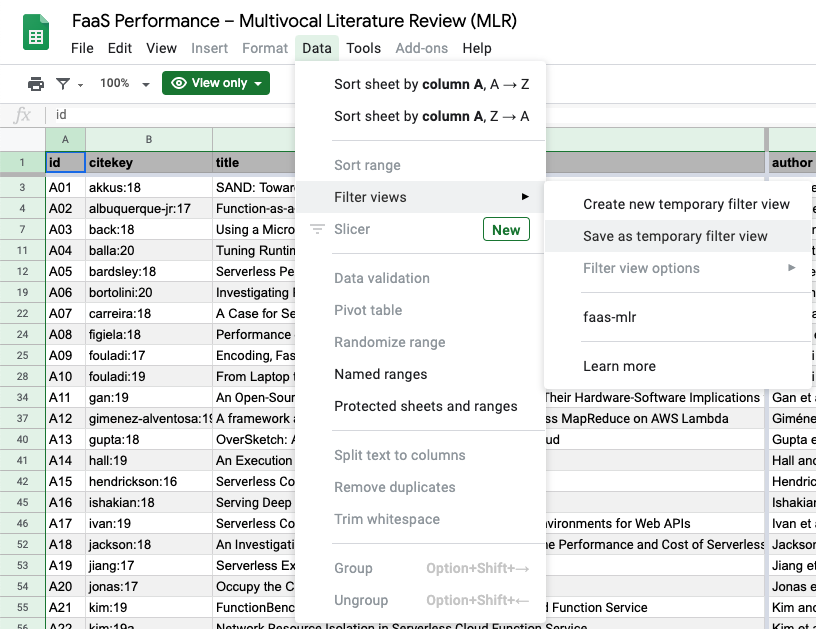
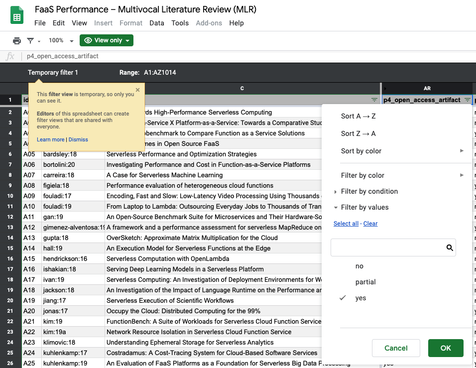
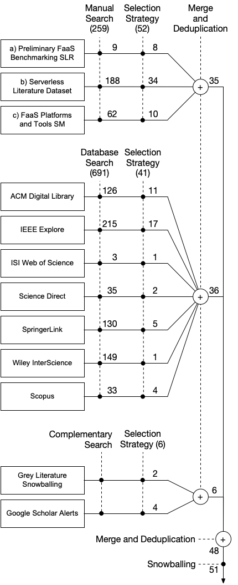
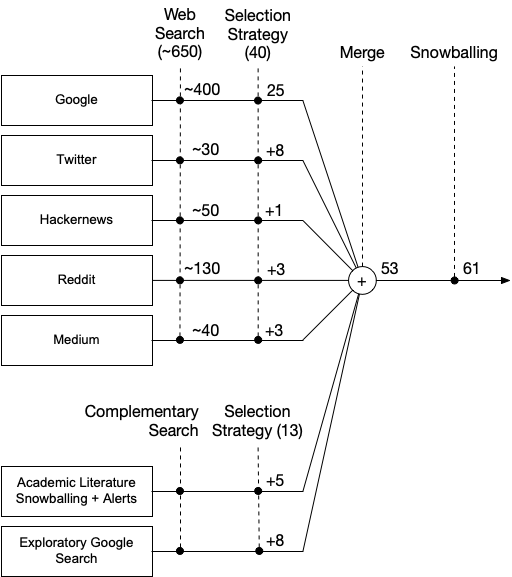

Replication Package for "The State of Research on Function-as-a-Service (FaaS) Performance Evaluation: A Multivocal Literature Review (MLR)"
[![CC BY 4.0][cc-by-shield]][cc-by]
=========

[cc-by]: http://creativecommons.org/licenses/by/4.0/
[cc-by-image]: https://i.creativecommons.org/l/by/4.0/88x31.png
[cc-by-shield]: https://img.shields.io/badge/License-CC%20BY%204.0-lightgrey.svg

This replication package contains the raw dataset, scripts to produce all plots, and documentation on how to replicate our MLR study on FaaS performance evaluation.

## Dataset

All extracted data originating from academic and grey literature studies is available as machine-readable CSV ([./data/faas_mlr_raw.csv](./data/faas_mlr_raw.csv)) and human-readable XLSX ([./data/faas_mlr_raw.xlsx](./data/faas_mlr_raw.xlsx)).
The Excel file also contains all 700+ comments with guidance, decision rationales, and extra information.
It is configured with a filtered view to display only *relevant* sources but contains the complete data (i.e., including discussion for sources considered to be *not relevant* in our context).

### Interactive GSheet

The latest version is also available online as an interactive Google spreadsheet (GSheet): https://docs.google.com/spreadsheets/d/1EK9yg9fMZIDybnbi7thsnBx1NdqDmkW86sMygH9r8q8

The following steps describe how to use interactive querying:

1. Chose `Data > Filter views > Save as temporary filter view`

    

2. Explore the data set using GSheet [sort & filter](https://support.google.com/docs/answer/3540681) functionality (e.g., discover open source studies):

    

### Academic Literature Search Queries

The [query_academic](./data/query_academic) directory contains all search results in the `*.bib` format.
The following figure summarizes all sources:



#### 1) Manual Search

*Manual Search* consists of screening the following related publications:

* a) J. Kuhlenkamp and S. Werner, “Benchmarking FaaS platforms: Call for community participation,” in
2018 IEEE/ACM International Conference on Utility and Cloud Computing Companion (UCC Companion), pp. 189–194, 2018.
* b) J. Spillner and M. Al-Ameen, “Serverless literature dataset,” 2019.
* c) V. Yussupov, U. Breitenbücher, F. Leymann, and M. Wurster, “A systematic mapping study on engineering function-as-a-service platforms and tools,” in Proceedings of the 12th IEEE/ACM International Conference on Utility and Cloud Computing, pp. 229–240, 2019.

#### 2) Database Search

For the *Database Search* strategy, we use the following search string for all sources:

```none
(serverless OR faas) AND (performance OR benchmark) AND experiment AND lambda
```

We only consider publications after 2015-01-01 by either configuring the search engine appropriately or adding the following suffix to the search string: `AND year>=2015`.

#### Database Search Engines

We use the advanced query syntax of the following academic research databases:

| ID | Research Database                 | Advanced Query Engine  | Docs |
| --------- | ---------------------             | ---------------------- | --- |
| acm       | ACM Digital Library               | https://dlnext.acm.org/search/advanced | [Sidebar](https://dlnext.acm.org/search/advanced) |
| ieee      | IEEE Explore                      | https://ieeexplore.ieee.org/search/advanced/command | [Link](https://ieeexplore.ieee.org/Xplorehelp/#/searching-ieee-xplore/command-search#using-command-search) |
| wos       | ISI Web of Science<sup>*</sup>    | http://apps.webofknowledge.com/UA_GeneralSearch_input.do?product=UA&search_mode=GeneralSearch | [Link](https://images.webofknowledge.com/images/help/WOS/hp_advanced_search.html) |
| sd | Science Direct                | https://www.sciencedirect.com/search/advanced | [Link](https://service.elsevier.com/app/answers/detail/a_id/25974/supporthub/sciencedirect/) |
| springer  | SpringerLink                      | https://link.springer.com/search | [Link](https://link.springer.com/searchhelp) |
| wiley     | Wiley InterScience                | https://onlinelibrary.wiley.com/search/advanced | [PDF](https://onlinelibrary.wiley.com/pb-assets/WOL_User_Guide-1524059964203.pdf) |
| scopus    | Scopus<sup>*</sup>                | https://www.scopus.com/search/form.uri?display=advanced | [Link](https://service.elsevier.com/app/answers/detail/a_id/11365/supporthub/scopus/~/how-can-i-best-use-the-advanced-search%3F/) |

<sup>*</sup> Requires institutional (e.g., through university VPN) or personal account

#### Initial Search Details

The following table summarizes the initial search results and provides the exact query string and direct link for all databases.
The search was performed at 2019-10-21 and all results are available as `ID.bib` under [./data/query_academic](./data/query_academic).

| ID    | #    | Exact Query String and Link |
| ---   | ---: | --------------------------- |
| acm   | 126  | [[[All: serverless] OR [All: faas]] AND [[All: performance] OR [All: benchmark]] AND [All: experiment] AND [All: lambda] AND [Publication Date: (01/01/2015 TO *)]](https://dlnext.acm.org/action/doSearch?fillQuickSearch=false&expand=all&AfterYear=2015&AllField=%28AllField%3A%28serverless%29+OR+AllField%3A%28faas%29%29+AND+%28AllField%3A%28performance%29+OR+AllField%3A%28benchmark%29%29+AND+AllField%3A%28experiment%29+AND+AllField%3A%28lambda%29) |
| ieee  | 215  | [((("Full Text & Metadata":serverless) OR ("Full Text & Metadata":faas)) AND (("Full Text & Metadata":performance) OR ("Full Text & Metadata":benchmark)) AND ("Full Text & Metadata":experiment) AND ("Full Text & Metadata":lambda))](https://ieeexplore.ieee.org/search/searchresult.jsp?queryText=(((%22Full%20Text%20.AND.%20Metadata%22:serverless)%20OR%20(%22Full%20Text%20.AND.%20Metadata%22:faas))%20AND%20((%22Full%20Text%20.AND.%20Metadata%22:performance)%20OR%20(%22Full%20Text%20.AND.%20Metadata%22:benchmark))%20AND%20(%22Full%20Text%20.AND.%20Metadata%22:experiment)%20AND%20(%22Full%20Text%20.AND.%20Metadata%22:lambda))&highlight=true&returnFacets=ALL&returnType=SEARCH&ranges=2015_2019_Year) |
| wos<sup>*</sup>   |   3 | [ALL=((serverless OR faas) AND (performance OR benchmark) AND experiment AND lambda)](http://apps.webofknowledge.com/WOS_AdvancedSearch_input.do?SID=E2l2NklrwK4CVWkWl4h&product=WOS&search_mode=AdvancedSearch) |
| sd    |  35 | [(serverless OR faas) AND (performance or benchmark) AND experiment AND lambda](https://www.sciencedirect.com/search/advanced?qs=%28serverless%20OR%20faas%29%20AND%20%28performance%20or%20benchmark%29%20AND%20experiment%20AND%20lambda&date=2015-2019&show=25&sortBy=relevance) |
| springer | 130 | [(serverless OR faas) AND (performance OR benchmark) AND experiment AND lambda](https://link.springer.com/search?query=%28serverless+OR+faas%29+AND+%28performance+OR+benchmark%29+AND+experiment+AND+lambda&date-facet-mode=between&previous-end-year=2020&facet-end-year=2020&previous-start-year=1917&facet-start-year=2015) |
| wiley | 149 | [(serverless OR faas) AND (performance OR benchmark) AND experiment AND lambda](https://onlinelibrary.wiley.com/action/doSearch?AllField=%28serverless+OR+faas%29+AND+%28performance+OR+benchmark%29+AND+experiment+AND+lambda&content=articlesChapters&countTerms=true&target=default&AfterYear=2015&BeforeYear=2019) |
| scopus | 33 | [(ALL(serverless) OR ALL(faas)) AND (ALL(performance) OR ALL(benchmark)) AND ALL(experiment) AND ALL(lambda) AND PUBYEAR > 2015](https://www.scopus.com/results/results.uri?sort=plf-f&src=s&sid=bf99d0d7180b7b59820f3256277c8524&sot=a&sdt=a&sl=126&s=%28ALL%28serverless%29+OR+ALL%28faas%29%29+AND+%28ALL%28performance%29+OR+ALL%28benchmark%29%29+AND+ALL%28experiment%29+AND+ALL%28lambda%29+AND+PUBYEAR+%3e+2015&origin=searchadvanced&editSaveSearch=&txGid=c6303d88af988acc1ab6fa8113b78c03) |

<sup>*</sup> Requires manual steps: 1) copy the query string into the advanced search field 2) add custom year range 2015 - 2019

#### Export Instructions

The following instructions show how query results from the research databases are exported into `*.bib` files:

* acm: 1) choose 100 per page 2) select all 3) export citation 4) choose bibtex
* ieee: 1) choose 100 per page 2) select all 3) export > citations > bibtex 4) copy/paste into ieee.bib file
* wos: 1) select page 2) Export > Other file formats 3) Choose Bibtex and author,source,title
* sd: 1) display 100 per page 2) Export > Export citations to bibtex
* springer: 1) Download results as CSV 2) Open CSV in Excel and copy all DOIs 3) Paste DOIs into Zotero's "Add item by identifier" 4) Right-click selection and export all to bibtex
  * SpringerLink does not support bibtex export and therefore, we followed a workaround described [here](https://www.leniel.net/2017/06/using-zotero-to-convert-springerlink-full-csv-search-result-to-bibtex-format.html). Notice that the import/matching could take a while until the indices and paper counts in the list are updated properly.
* wiley: 1) Select all 2) Export citations > bibtex 3) repeat for all pages 4) merge all result files
* scopus: 1) choose 100 per page 2) select all 3) Export > Bibtex

#### Query Adaptations

We performed the following adaptations of the search string:

* Without `lambda` keyword: Omitting the keyword `lambda` resulted in too many false positives with a total of 4805 matches (vs 691). We used an initial training set of 43 publications and found that 100% of them contain the string "lambda" in their fulltext.
* With double quotes `"`: Using double quotes includes only exact string matches and resulted in a total of 376 publications (vs 691) or 357 after duplicate removal. We found that this query is too narrow as it misses 6 relevant publications that are covered with our chosen search string.

### Grey Literature Search Queries

The [query_grey](./data/query_grey) directory contains all search results in the formats `*.pdf` and `*.html`.
The following figure summarizes all sources:



For the *1) Web Search* strategy, we use the following search string for all sources:

```none
(serverless OR faas) AND (performance OR benchmark)
```

We perform an additional Google search with the exact same search string as used for academic literature but adjust the search string for more informal grey literature by omitting the keywords `experiment` and `lambda`.

#### Web Search Engines

We use the following web search engines:

| ID | Search Engine                | URL  |
| --------- | --------------------- | ---------------------- |
| google    | Google Web Search     | https://www.google.com/ |
| twitter   | Twitter Search        | https://twitter.com/ |
| hackernews | Hacker News Algolia Search | https://hn.algolia.com/ |
| reddit | Reddit Search | https://www.reddit.com/search |
| medium | Medium Search | https://medium.com/search |

#### Web Search Details

The following table summarizes the number of relevant studies and provides the exact query string and direct link for all web searches.
The search was performed at 2019-10-21 and all results are available as `ID.bib` under [./data/query_academic](./data/query_academic).
Notice that the number of relevant studies are already de-duplicated, meaning that we found 18 relevant studies through google1 search and the additional +7 studies from google2 search only include new non-duplicate studies.
Notice that with the exception of Google Search, advanced queries including logical expressions (e.g., "OR") are not supported.
Therefore, we manually compose four subqueries to implement an equivalent search string.

| ID    | Date | #    | Exact Query String and Link |
| ---   | --- | ---: | --------------------------- |
| google1       | 2019/11/26 | 18  | [("serverless" OR "faas") AND ("performance" OR "benchmark") AND "experiment" AND "lambda" after:2015-01-01](https://www.google.com/search?q=(%22serverless%22+OR+%22faas%22)+AND+(%22performance%22+OR+%22benchmark%22)+AND+%22experiment%22+AND+%22lambda%22+after:2015-01-01&oq=(%22serverless%22+OR+%22faas%22)+AND+(%22performance%22+OR+%22benchmark%22)+AND+%22experiment%22+AND+%22lambda%22+after:2015-01-01) |
| google2       | 2019/11/26 | +7 | [("serverless" OR "faas") AND ("performance" OR "benchmark") after:2015-01-01](https://www.google.com/search?q=(%22serverless%22+OR+%22faas%22)+AND+(%22performance%22+OR+%22benchmark%22)+after%3A2015-01-01&oq=(%22serverless%22+OR+%22faas%22)+AND+(%22performance%22+OR+%22benchmark%22)+after%3A2015-01-01) |
| twitter1      | 2019/12/03 | +2 | [faas benchmark](https://twitter.com/search?q=serverless%20benchmark%20lang%3Aen&src=typed_query) |
| twitter2      | 2019/12/03 | +3 | [serverless benchmark](https://twitter.com/search?q=serverless%20benchmark%20lang%3Aen&src=typed_query) |
| twitter3      | 2019/12/03 | +0 | [faas performance](https://twitter.com/search?q=faas%20performance%20lang%3Aen&src=typed_query) |
| twitter4      | 2019/12/03 | +3 | [serverless performance](https://twitter.com/search?q=serverless%20performance%20lang%3Aen&src=typed_query) |
| hackernews1   | 2019/12/06 | +0 | [faas benchmark](https://hn.algolia.com/?dateRange=all&page=0&prefix=true&query=faas%20benchmark&sort=byPopularity&type=story) |
| hackernews2   | 2019/12/06 | +0 | [serverless benchmark](https://hn.algolia.com/?dateRange=all&page=0&prefix=true&query=serverless%20benchmark&sort=byPopularity&type=story) |
| hackernews3   | 2019/12/06 | +0 | [faas performance](https://hn.algolia.com/?dateRange=all&page=0&prefix=true&query=faas%20performance&sort=byPopularity&type=story) |
| hackernews4   | 2019/12/06 | +1 | [serverless performance](https://hn.algolia.com/?dateRange=all&page=0&prefix=true&query=serverless%20performance&sort=byPopularity&type=story) |
| reddit1       | 2019/12/06 | +0 | [faas benchmark](https://www.reddit.com/search/?q=faas%20benchmark) |
| reddit2       | 2019/12/06 | +0 | [serverless benchmark](https://www.reddit.com/search/?q=serverless%20benchmark) |
| reddit3       | 2019/12/06 | +3 | [faas performance](https://www.reddit.com/search/?q=faas%20performance) |
| reddit4       | 2019/12/06 | +0 | [serverless performance](https://www.reddit.com/search/?q=serverless%20performance) |
| medium1       | 2020/02/18 | +0 | [faas benchmark](https://medium.com/search?q=faas%20benchmark) |
| medium2       | 2020/02/18 | +2 | [serverless benchmark](https://medium.com/search?q=serverless%20benchmark) |
| medium3       | 2020/02/18 | +0 | [faas performance](https://medium.com/search?q=faas%20performance) |
| medium4       | 2020/02/18 | +1 | [serverless performance](https://medium.com/search?q=serverless%20performance) |

#### Export Instructions

We used non-personalized private search mode through private Google Chrome browser windows wherever possible.
Notice that the number of search results for Google search is only a rough estimate and typically changes when reaching the last page.
Further, Google sometimes omits entries similar to the displayed results: "In order to show you the most relevant results, we have omitted some entries very similar to the 200 already displayed. If you like, you can repeat the search with the omitted results included."
In that case, we repeated the search with and without the omitted results and kept both versions (e.g., google2 and google2.2 or google4.2 but google4 doesn't exist because omitted results have less pages).
We used the Google Chrome export options for PDF and HTML in combination with the following steps:

* google: 1) Paste link in private browser mode 2) Settings > Search Settings: choose region "United States" and 100 results per page
* twitter: 1) Paste link in browser 2) scroll down to the bottom of the page until all search results appear
* hackernews: 1) Paste link in browser 2) scroll down to the bottom of the page until all search results appear
* reddit: 1) Paste link in browser 2) scroll down to the bottom of the page until all search results appear
* medium: 1) Paste link in browser 2) scroll down to the bottom of the page until all search results appear

The authors also saved PDF or HTML files of all relevant articles in case some sources become unavailable.
However, we cannot publish these website copies for legal reasons.

## Plots

An up-to-date R language toolchain preferably with [RStudio](https://rstudio.com/) is required.
Install the required packages imported at the top of each `*.R` file (e.g., `install.packages("ggplot2")`) from the official CRAN package repository (RStudio automatically detects to-be-installed packages).

1. Open the RStudio project [faas_mlr.Rproj](./plots/faas_mlr.Rproj) (or alternatively set the R working directory to `./plots`)
2. Run a given `*.R` file to produce the corresponding `*.pdf` plot. Example: `characteristics.R` produces `characteristics.pdf`.
